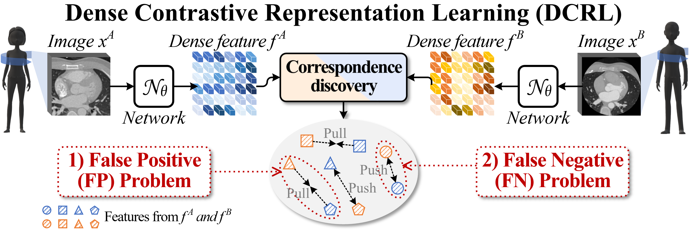

# GEMINI: Homeomorphism Prior for False Positive and Negative Problem in Medical Image Dense Contrastive Representation Learning

[NOTE!!]**The code will be gradually opened, and be completely opened after this paper is published.**

[NOTE!!]**This code is a journal extended version of the conference work of [GVSL](https://github.com/YutingHe-list/GVSL).**

Dense contrastive representation learning (DCRL), with its powerful dense posterior distribution learning ability, has greatly improved the learning efficiency for image dense prediction tasks, showing its great potential to reduce the large costs of medical image collection and dense annotation. However, the properties of medical images make unreliable correspondence discovery, bringing an open problem of large-scale false positive and negative (FP&N) feature pairs in DCRL. In this project, we propose GEoMetric vIsual deNse sImilarity (GEMINI) Learning  which embeds the homeomorphism prior to DCRL and enables a reliable correspondence discovery to learn an effective dense contrast under the condition of medical images' inherent topology. 

<p align="center"></p>

## Paper
This repository provides the official PyTorch implementation of GEMINI in the following papers:

**GEMINI: Homeomorphism Prior for False Positive and Negative Problem in Medical Image Dense Contrastive Representation Learning**<br/> 
[Yuting He](https://yutinghe-list.github.io/), [Boyu Wang](https://sites.google.com/site/borriewang/), [Rongjun Ge](https://scholar.google.com/citations?user=v8K8HIkAAAAJ&hl=en), [Yang Chen](https://scholar.google.com/citations?user=LxjxwpgAAAAJ&hl=en), [Guanyu Yang*](https://cse.seu.edu.cn/2019/0103/c23024a257233/page.htm), [Shuo Li](http://www.digitalimaginggroup.ca/members/shuo.php)<br/>
Southeast University <br/>

## Citation
If you use this code or use our pre-trained weights for your research, please cite our papers:
```
wait
```

## Official implementation
- [PyTorch/](https://github.com/YutingHe-list/GVSL/tree/main/GEMINI/PyTorch)

## Acknowledgments
This research was supported by the National Key Research and Development Program of China (No. 2021ZD0113202), National Natural Science Foundation under grants (61828101, 62101249), Natural Science Foundation of Jiangsu Province (BK20210291), Excellence Project Funds of Southeast University, CAAI-Huawei MindSpore Open Fund, and Scientific Research Foundation of Graduate School of Southeast University (YBPY2139). We thank the Big Data Computing Center of Southeast University for providing the facility support on the numerical calculations. 
