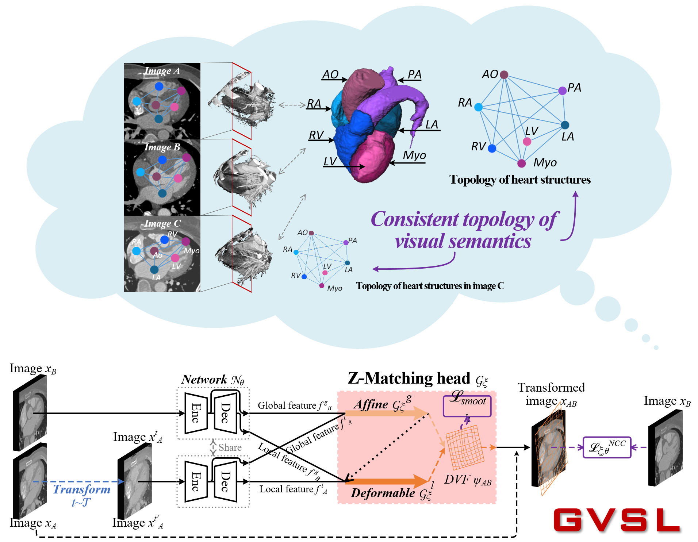

<p align="center"></p>

--------------------------------------------------------------------------------
[[Homepage]](https://x-ark.github.io/)

[NEWS!]**This paper has been accpeted by [CVPR 2023](https://cvpr.thecvf.com/)! The basic code on [PyTorch](https://github.com/YutingHe-list/GVSL/tree/main/PyTorch) has been opened!** 

[NOTE!!]**The code will be gradually and continuously opened!**

Learning inter-image similarity is crucial for 3D medical images self-supervised pre-training, due to their sharing of numerous same semantic regions. However, the lack of the semantic prior in metrics and the semantic-independent variation in 3D medical images make it challenging to get a reliable measurement for the inter-image similarity, hindering the learning of consistent representation for same semantics. We investigate the challenging problem of this task, i.e., learning a consistent representation between images for a clustering effect of same semantic features. Our Geometric Visual Similarity Learning embeds the prior of topological invariance into the measurement of the inter-image similarity for consistent representation of semantic regions.

<p align="center"></p>

## Paper
This repository provides the official PyTorch implementation of GVSL in the following papers:

**[Geometric Visual Similarity Learning in 3D Medical Image Self-supervised Pre-training](https://arxiv.org/abs/2303.00874)** <br/> 
[Yuting He](https://yutinghe-list.github.io/), [Guanyu Yang*](https://cse.seu.edu.cn/2019/0103/c23024a257233/page.htm), [Rongjun Ge](https://scholar.google.com/citations?user=v8K8HIkAAAAJ&hl=en), [Yang Chen](https://scholar.google.com/citations?user=LxjxwpgAAAAJ&hl=en), Jean-Louis Coatrieux,  [Boyu Wang](https://sites.google.com/site/borriewang/), [Shuo Li](http://www.digitalimaginggroup.ca/members/shuo.php) <br/>
Southeast University <br/>
**IEEE/CVF Conference on Computer Vision and Pattern Recognition 2023**<br/>

## Pre-trained weights

We are gradually opening up pre-trained parameters on more datasets, please focus on our **[Pre-Trained Model Zoo](https://github.com/YutingHe-list/GVSL/tree/main/PyTorch/Downstream/pre_weight)** page.

## Citation
If you use this code or use our pre-trained weights for your research, please cite our papers:
```
@InProceedings{He_2023_CVPR,
    author    = {Yuting He, Guanyu Yang, Rongjun Ge, Yang Chen, Jean-Louis Coatrieux, Boyu Wang, Shuo Li},
    title     = {Geometric Visual Similarity Learning in 3D Medical Image Self-supervised Pre-training},
    booktitle = {Proceedings of the IEEE/CVF Conference on Computer Vision and Pattern Recognition (CVPR)},
    month     = {June},
    year      = {2023},
    pages     = {}
}
```


## Acknowledgments

This research was supported by the Intergovernmental Cooperation Project of the National Key Research and Development Program of China(2022YFE0116700), CAAI-Huawei MindSpore Open Fund and Scientific Research Foundation of Graduate School of Southeast University(YBPY2139). We thank the Big Data Computing Center of Southeast University for providing the facility support. 
